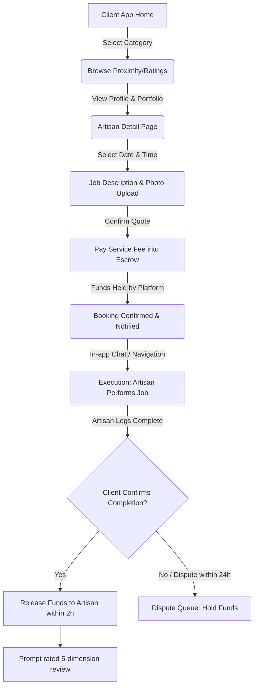
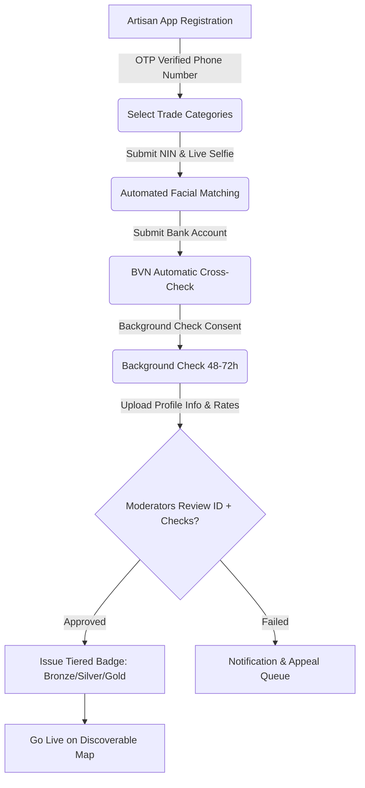

# My_Fix PRD Analysis & Strategic Roadmap

> [!NOTE]
> This analysis is compiled from the **My_Fix v1.0 PRD (May 2026)** to serve as a design and engineering reference for the core team.

---

## 1. Executive Summary & Brand Identity

**My_Fix** is a mobile-first, two-sided marketplace designed to formalize and digitize the home services industry in Lagos, Nigeria. The platform connects verified, skilled artisans (plumbers, electricians, tilers, tailors, etc.) with homeowners and tenants who need reliable, trustworthy, and fairly-priced services.

### Core Brand Identity
Based on the existing asset files (`myfix_logo.svg`), the brand utilizes a high-trust, premium palette:
*   **Forest Green** (`#1A6B3A`): Represents safety, growth, and trust.
*   **Lagos Gold/Yellow** (`#D4A017`): Represents premium service quality, energy, and value.
*   **White & Charcoal** (`#FFFFFF`, `#222222`): For modern, readable typography.

---

## 2. Key User Personas & Flows

To understand our target audience and design high-fidelity components, we analyze the two core personas defined in the PRD:

### 👤 Persona A: The Busy Lagos Professional (Client)
*   **Name**: Chidinma, 34 (Lekki Phase 1, Lagos)
*   **Needs**: Fast, high-trust repairs with upfront, transparent pricing and zero security concerns.
*   **Key Behavior**: Mobile-first, active user of fintech apps (Opay, Kuda), sensitive to time and safety.

### 🛠️ Persona B: The Skilled Artisan
*   **Name**: Emeka, 28 (Surulere, Lagos)
*   **Needs**: Inbound job consistency, digital reputation (since word-of-mouth is limited), and guaranteed payouts without payment collection delays.
*   **Key Behavior**: Relies on WhatsApp, basic smartphone user, requires simple, low-literacy-friendly UX.

---

## 3. Comprehensive System Flowcharts

### 🔄 Client Booking Flow


### 📋 Artisan Onboarding & Verification Flow


---

## 4. Key Functional Pillars & MVP Scope

Here are the primary components that must be delivered in the Phase 1 MVP (Months 1–4):

| Feature Category | Description | MVP Requirement |
| :--- | :--- | :--- |
| **1. Trust & Verification** | The core credibility engine. | Real-time **NIN validation** (NIMC API) + **BVN cross-check** + **Tiered Verification Badges** (Bronze/Silver/Gold). |
| **2. Geolocation Discovery** | Finding nearby artisans. | **Lagos LGA / Neighborhood level search** (Surulere, Lekki, Ikeja) with smart proximity matching. |
| **3. Escrow Payments** | Removing cash friction. | **Paystack integration** (Card, Transfer, USSD) to secure funds prior to job start; automatic payouts. |
| **4. Calendar & Bookings** | Organizing matches. | **Live availability scheduler**, push/SMS reminders, counter-propositions. |
| **5. Multi-Dim Reviews** | Quality insurance. | **Post-completion only** rating across Quality, Punctuality, Professionalism, Value, and Cleanliness. |

---

## 5. Technical Stack Breakdown

The PRD highlights a scalable, modern mobile-first stack:

```
┌─────────────────────────────────────────────────────────┐
│              Mobile App: React Native                   │
└────────────────────────────┬────────────────────────────┘
                             │ HTTPS / TLS 1.3
                             ▼
┌─────────────────────────────────────────────────────────┐
│     AWS API Gateway & Web Application Firewall (WAF)    │
└────────────────────────────┬────────────────────────────┘
                             │
                             ▼
┌─────────────────────────────────────────────────────────┐
│      Node.js (Express) Microservices on ECS / EKS       │
└───────┬────────────┬──────────────────┬────────────┬────┘
        │            │                  │            │
        ▼            ▼                  ▼            ▼
┌──────────────┐┌──────────────┐┌──────────────┐┌──────────────┐
│  PostgreSQL  ││ Redis Cache  ││Elasticsearch ││  AWS S3 Blob │
│ (Primary DB) ││(Session/Geo) ││ (Geo Search) ││(Private/PII) │
└──────────────┘└──────────────┘└──────────────┘└──────────────┘
        ▲                               ▲
        │                               │
        ▼                               ▼
┌──────────────────────────────┐┌──────────────────────────────┐
│ Paystack Payment Gateway     ││ NIMC Identity Verification   │
└──────────────────────────────┘└──────────────────────────────┘
```

---

## 6. Strategic Open Questions & Expert Recommendations

Before writing the frontend code, we must address these open questions from the PRD:

> [!IMPORTANT]
> **Open Question 1: Commission Structure**
> *   *Recommendation*: Implement a dynamic commission model. Charge **10%** for high-ticket services (e.g., Tiling, AC Installation) and **15%** for lower call-out services (e.g., small Laundry or Tailoring adjustments) to protect artisan margins while maximizing platform revenues.
>
> **Open Question 2: Background Checks Vendor**
> *   *Recommendation*: Partner with **Smile Identity** or **Youverify** for automated real-time verification in Nigeria. Doing this in-house is high-risk, expensive, and scales poorly.
>
> **Open Question 3: Manual Fallbacks for NIN API**
> *   *Recommendation*: NIMC APIs frequently experience downtime. We must design a "pending review" UX state that lets artisans complete their profiles while a manual backoffice admin queue validates documents.

---

## 7. Next Steps & Proposed Demonstration

To bring this PRD to life and allow stakeholder alignment, I propose creating a **gorgeous, premium, highly interactive browser-based dashboard/portal mockup** right here in our workspace. 

### What we will build:
1.  **A Premium Homepage/Landing Page** with a stunning dark/light theme, custom glassmorphism style, smooth micro-animations, utilizing the **My_Fix brand identity** (Lagos Gold + Forest Green).
2.  **An Interactive Client Search Portal** allowing you to filter artisans by neighborhood (e.g., Surulere, Ikeja, Lekki Phase 1), trade (Plumber, Electrician), and view live "Verified Professional Badge" tiers.
3.  **An Artisan Verification Simulator** where you can click through Emeka’s verification steps: submitting NIN/BVN, seeing a mocked NIMC API live response, and achieving the "Gold Tier" badge.
4.  **An Escrow Transaction Simulator** demonstrating the payment flow from Paystack wallet setup to escrow release.

Let's discuss which interactive flow you would like to prioritize first!
